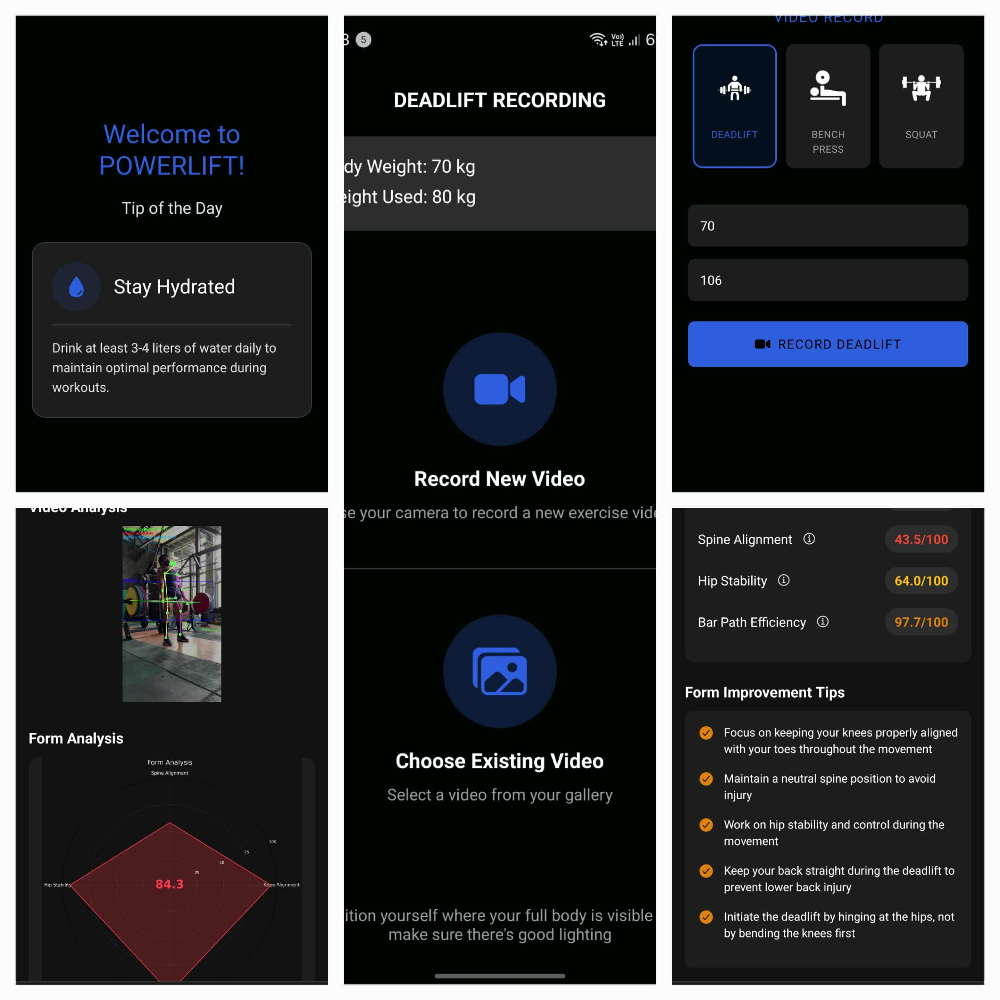

# PowerLift: AI-Powered Exercise Form Analysis System



**PowerLift** is an advanced computer vision system for real-time exercise form assessment in strength training. It analyzes workout videos to provide per-repetition, biomechanically-informed feedback for deadlifts, squats, and bench presses.

## Table of Contents

- [Overview](#overview)
- [Key Features](#key-features)
- [Technology Stack](#technology-stack)
- [System Architecture](#system-architecture)
- [Getting Started](#getting-started)
  - [Backend Setup](#backend-setup)
  - [Frontend Setup](#frontend-setup)
- [How It Works](#how-it-works)
- [Form Classification System](#form-classification-system)
- [Project Structure](#project-structure)
- [Documentation](#documentation)
- [License](#license)

---

## Overview

PowerLift is a thesis project that combines advanced computer vision, biomechanical analysis, and machine learning to provide real-time form feedback during weightlifting exercises. The system processes short workout videos and scores each repetition across multiple biomechanical dimensions (knee alignment, spine alignment, hip stability, and bar path efficiency), classifying results as **Good**, **Needs Improvement**, or **Poor**.

User corrections are collected and can be used to iteratively retrain and improve the classification models.

---

## Key Features

- **Real-Time Form Analysis**: Processes videos to extract pose data and analyze exercise form instantly
- **Multi-Exercise Support**: Specialized analysis for deadlifts, squats, and bench presses
- **Biomechanical Scoring**: Evaluates performance across four key metrics:
  - Knee Alignment (0-100)
  - Spine Alignment (0-100)
  - Hip Stability (0-100)
  - Bar Path Efficiency (0-100)
- **Intelligent Classification**: Score-based Multi-Class SVM (MCSVM) inspired system for categorizing form quality
- **User Feedback Collection**: Stores user corrections for model improvement and iterative retraining
- **Cross-Platform Frontend**: Built with Expo/React Native for iOS, Android, and web
- **RESTful Backend API**: Flask-based Python backend with real-time WebSocket communication
- **Barbell Detection**: YOLOv8-powered object detection for tracking barbell position
- **Advanced Pose Tracking**: MoveNet + Extended Kalman Filter for robust landmark tracking

---

## Technology Stack

### Frontend
- **Framework**: Expo / React Native (TypeScript)
- **Language**: TypeScript / JavaScript
- **State Management**: Context API / Custom Hooks
- **Styling**: Native styles with theme customization

### Backend
- **Framework**: Flask with Flask-SocketIO
- **Language**: Python 3.8+
- **Pose Estimation**: TensorFlow Lite + MoveNet
- **Object Detection**: YOLOv8
- **Classification**: scikit-learn SVM models
- **Data Processing**: NumPy, Pandas
- **Real-Time Communication**: WebSockets (Socket.IO)

### Model Artifacts
- **Pose Model**: MoveNet TensorFlow Lite (.tflite)
- **Barbell Detector**: YOLOv8 PyTorch (.pt)
- **SVM Classifiers**: scikit-learn pickle files (.pkl)

### Data Management
- **Video Uploads**: MP4 format
- **Feedback Storage**: JSON (user_feedback.json, enhanced_user_feedback.json)
- **User Management**: users.json
- **Analysis Results**: JSON evaluation reports

---

## System Architecture

```
┌─────────────────────────────────────────────────────────────────┐
│                         Frontend (Expo)                         │
│                    iOS / Android / Web                          │
└──────────────────────────┬──────────────────────────────────────┘
                           │ REST API + WebSocket
                           ▼
┌─────────────────────────────────────────────────────────────────┐
│                    Backend API (Flask)                          │
│                  Real-Time Video Processing                     │
├─────────────────────────────────────────────────────────────────┤
│ ┌──────────────┐  ┌────────────────┐  ┌───────────────────────┐ │
│ │ Video        │  │ Pose Detector  │  │ Barbell Detector      │ │
│ │ Processor    │─▶│ (MoveNet)      │─▶│ (YOLOv8)              │ │
│ └──────────────┘  └────────────────┘  └───────────────────────┘ │
│         │                                      │                │
│         └──────────────┬───────────────────────┘                │
│                        ▼                                        │
│         ┌──────────────────────────────┐                        │
│         │   Form Analysis Engine       │                        │
│         │  (Biomechanical Scoring)     │                        │
│         └──────────────┬───────────────┘                        │
│                        ▼                                        │
│         ┌──────────────────────────────┐                        │
│         │   MCSVM Classification       │                        │
│         │   (Score-Based Feedback)     │                        │
│         └──────────────┬───────────────┘                        │
│                        ▼                                        │
│         ┌──────────────────────────────┐                        │
│         │   Feedback Generation        │                        │
│         │   & Storage                  │                        │
│         └──────────────────────────────┘                        │
└─────────────────────────────────────────────────────────────────┘
```

---

## Getting Started

### Prerequisites

- **Python**: 3.8 or higher
- **Node.js**: 16+
- **npm**: 8+
- **Git**: For version control

### Backend Setup

1. **Clone and navigate to the backend directory**:
   ```bash
   cd Powerlift-Backend
   ```

2. **Create a virtual environment**:
   ```bash
   # macOS/Linux
   python3 -m venv .venv
   source .venv/bin/activate

   # Windows (PowerShell)
   python -m venv .venv
   .\.venv\Scripts\Activate.ps1
   ```

3. **Install dependencies**:
   ```bash
   pip install -r requirements.txt
   ```

4. **Run the API server**:
   ```bash
   python run_api.py
   ```

   The backend will start on `http://localhost:5000` (or specified port)

5. **Optional: Run evaluation/training scripts**:
   ```bash
   # Evaluate form metrics
   python evaluate_mcsvm_comprehensive.py

   # Retrain models with collected feedback
   python retrain_mcsvm.py
   ```

### Frontend Setup

1. **Navigate to the frontend directory**:
   ```bash
   cd Powerlift-Frontend
   ```

2. **Install dependencies**:
   ```bash
   npm install
   ```

3. **Start the development server**:
   ```bash
   npx expo start
   ```

4. **Open on a device or emulator**:
   - Press `i` for iOS Simulator
   - Press `a` for Android Emulator
   - Scan QR code with Expo Go app on your phone

---

## How It Works

### 1. Video Upload & Processing
- User uploads a workout video containing one or more repetitions
- Backend receives video and extracts frames at consistent intervals

### 2. Pose & Object Detection
- **MoveNet** detects 33 body keypoints (joints) in each frame
- **YOLOv8** detects barbell position and orientation
- **Extended Kalman Filter** smooths detection results across frames for temporal consistency

### 3. Biomechanical Analysis
The system calculates four core metrics for each repetition:

- **Knee Alignment**: Evaluates knee angle and lateral movement (knee valgus/varus)
- **Spine Alignment**: Measures spine curvature and checks for excessive rounding or hyperextension
- **Hip Stability**: Tracks hip height, symmetry, and proper hip hinge mechanics
- **Bar Path Efficiency**: Ensures barbell moves vertically with minimal horizontal deviation

### 4. Score-Based Classification
- Individual metric scores (0-100) are combined into an overall score
- Scores are mapped to form categories:
  - **≥85**: Good form (confidence: 80-95%)
  - **70-84**: Needs Improvement (confidence: 70-85%)
  - **<70**: Poor form (confidence: 65-80%)

### 5. User Feedback & Iterative Improvement
- Users can confirm or correct the classification
- Feedback is stored in JSON format
- Collected feedback can be used to retrain MCSVM classifiers for improved accuracy

---

## Form Classification System

### Current Approach: Score-Based MCSVM

PowerLift uses a **score-based Multi-Class SVM** classification system that maps biomechanical scores directly to form categories. This approach is:

- **Transparent**: Users understand why feedback is given (based on specific scores)
- **Immediate**: No ML model training required to provide feedback
- **Evolving**: Collects user corrections to eventually train traditional ML models

### Classification Categories

| Category | Score Range | Meaning |
|----------|-------------|---------|
| **Good** | ≥85 | Excellent technique with proper form |
| **Needs Improvement** | 70-84 | Good foundation but room for refinement |
| **Poor** | <70 | Significant form issues requiring correction |

### Example Feedback

For a deadlift with a score of 65:
- **Classification**: Poor form
- **Issue**: Spine alignment score of 55/100 (excessive lower back rounding)
- **Recommendation**: Focus on keeping a neutral spine; brace core before initiating lift

---

## Project Structure

```
Powerlift/
├── README.md                          # This file
├── powerlift-screenshot.png           # Project screenshot
│
├── Powerlift-Backend/
│   ├── backend/
│   │   ├── api.py                    # Main Flask API
│   │   ├── video_processor.py        # Video frame extraction
│   │   ├── frame_analyzer.py         # Biomechanical analysis
│   │   ├── auth.py                   # Authentication
│   │   ├── email_service.py          # Email notifications
│   │   ├── analyzers/                # Specialized analysis modules
│   │   ├── detectors/                # Detection models
│   │   ├── models/                   # ML models
│   │   └── utils/                    # Utility functions
│   ├── models/
│   │   └── model_metadata.json       # Model versioning
│   ├── evaluation_results/           # Analysis outputs
│   ├── requirements.txt              # Python dependencies
│   ├── run_api.py                    # Entry point
│   ├── train_mcsvm.py                # Model training script
│   ├── retrain_mcsvm.py              # Retraining with feedback
│   ├── TECHNICAL.md                  # Technical deep-dive
│   ├── MCSVM_INTEGRATION.md          # Classification system
│   └── README.md                     # Backend documentation
│
├── Powerlift-Frontend/
│   ├── app/
│   │   ├── (tabs)/                   # Tab-based navigation
│   │   ├── live.tsx                  # Real-time analysis
│   │   ├── video-analysis.tsx        # Video upload & analysis
│   │   ├── analysis-report.tsx       # Results display
│   │   ├── login.tsx                 # Authentication
│   │   └── ...                       # Other screens
│   ├── components/                   # Reusable UI components
│   ├── services/                     # API client services
│   ├── contexts/                     # React contexts
│   ├── constants/                    # App constants
│   ├── assets/
│   │   ├── images/
│   │   ├── fonts/
│   │   └── videos/
│   ├── package.json
│   ├── tsconfig.json
│   └── README.md
│
└── MCSVM/
    ├── evaluate_classification_metrics.py
    ├── generate_enhanced_feedback.py
    ├── classification_metrics_detailed_*.json
    └── CLASSIFICATION_METRICS_ANALYSIS.md
```

---

## Documentation

Comprehensive documentation is available in the following files:

| Document | Location | Purpose |
|----------|----------|---------|
| **Backend Guide** | [Powerlift-Backend/README.md](./Powerlift-Backend/README.md) | Form analysis implementation details |
| **Technical Deep-Dive** | [Powerlift-Backend/TECHNICAL.md](./Powerlift-Backend/TECHNICAL.md) | System architecture and algorithms |
| **MCSVM Integration** | [Powerlift-Backend/MCSVM_INTEGRATION.md](./Powerlift-Backend/MCSVM_INTEGRATION.md) | Classification system explanation |
| **Training Guide** | [Powerlift-Backend/BATCH_RETRAINING_README.md](./Powerlift-Backend/BATCH_RETRAINING_README.md) | Model training and retraining process |
| **Classification Metrics** | [MCSVM/CLASSIFICATION_METRICS_ANALYSIS.md](./MCSVM/CLASSIFICATION_METRICS_ANALYSIS.md) | Detailed metrics analysis |

---

## Key Highlights

### 🎯 Real-Time Performance
- Processes video frames in real-time using TensorFlow Lite models
- WebSocket-based bidirectional communication for instant feedback

### 🧠 Intelligent Analysis
- 33-point pose detection with temporal smoothing
- Multi-dimensional biomechanical scoring
- Exercise-specific analysis algorithms

### 📚 Adaptive Learning
- Collects user feedback for model improvement
- Supports batch retraining with accumulated data
- Score-based classification ready for supervised ML evolution

### 🔐 Secure Architecture
- JWT-based authentication
- Secure video upload handling
- User data isolation and privacy

### 📊 Comprehensive Analytics
- Per-rep scoring and visualization
- Historical performance tracking
- Feedback-driven insights

---

## Contributing

This is a thesis project. For collaboration or questions, please contact the development team.

---

## License

This project is part of a thesis at the TECH TITANS organization. All rights reserved.

---

## Acknowledgments

- **Computer Vision**: MediaPipe, YOLOv8, TensorFlow Lite
- **Machine Learning**: scikit-learn
- **Frontend Framework**: Expo, React Native
- **Backend Framework**: Flask
- **Data Processing**: NumPy, Pandas

---

**PowerLift** - Elevating Your Exercise Form | Thesis Project
